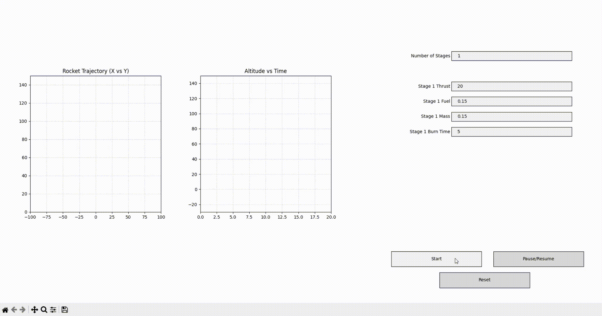

# Rocket Flight Simulator

A physics-based multi-stage rocket simulator that models thrust curves, drag forces, and parachute deployment. The simulator comes with two interfaces:
1. A legacy matplotlib-based GUI for batch simulation and visualization
2. A modern web-based telemetry dashboard for real-time monitoring

## Features

- **Multi-stage rocket simulation** with configurable thrust, fuel mass, dry mass, and burn time per stage
- **Realistic physics** including:
  - Thrust vectoring based on rocket angle
  - Gravity simulation (9.81 m/s²)
  - Drag modeling with different coefficients for freefall vs. parachute descent
  - Automatic pitch program initiation 3 seconds after liftoff
  - Parachute deployment at 200m altitude during descent
- **Real-time telemetry** including:
  - Altitude, velocity, and acceleration
  - Fuel remaining and stage status
  - Flight path trajectory (X/Y coordinates)
  - G-force calculations
  - Current flight stage status
- **Dual interface support**:
  - **Web Dashboard** (Recommended): Real-time Plotly.js visualizations via WebSocket
  - **Legacy GUI**: Matplotlib-based post-simulation animation

## Demos
- Legacy Interface
  
- Web-Based Dashboard
  

## System Requirements

- **C++ Compiler** (g++ or compatible)
- **Python 3.7+** with:
  - FastAPI
  - Uvicorn
  - Plotly.js (loaded via CDN in web interface)
  - Matplotlib (for legacy GUI)
  - Pandas (for legacy GUI)
  - NumPy (for legacy GUI)

## Installation

1. **Clone the repository**:
   ```bash
   git clone https://github.com/Doge2000/flight_sim
   cd flight_sim
   ```

2. **Compile the C++ simulation engine**:
   ```bash
   g++ main.cpp -o sim.exe
   ```

3. **Install Python dependencies** (for web dashboard):
   ```bash
   pip install fastapi uvicorn
   ```

4. **Install Python dependencies** (for legacy GUI):
   ```bash
   pip install matplotlib pandas numpy
   ```

## Quick Start

### Web Dashboard (Recommended)

1. Compile the simulation (if not already done):
   ```bash
   g++ main.cpp -o sim.exe
   ```

2. Start the WebSocket server:
   ```bash
   python -m uvicorn server:app --reload
   ```

3. Open your browser to: `http://localhost:8000`

4. Configure your rocket stages:
   - Set number of stages (1-3)
   - For each stage, configure:
     - Thrust (Newtons)
     - Fuel mass (kg)
     - Dry mass (kg)
     - Burn time (seconds)

5. Click "Start Simulation" to begin

6. Monitor real-time telemetry:
   - Altitude, velocity, and G-force readings
   - Flight status updates (Powered Ascent, Apogee, Parachute Deployed, etc.)
   - Live trajectory plot

### Legacy Matplotlib GUI

1. Compile the simulation:
   ```bash
   g++ main.cpp -o sim.exe
   ```

2. Run the simulation and visualization:
   ```bash
   python plot.py
   ```

3. Configure stages via the GUI interface:
   - Set number of stages
   - Adjust thrust, fuel mass, dry mass, and burn time for each stage
   - Click "Start" to run simulation and view animation

## Configuration

The simulator accepts command-line arguments in this format:
```
sim.exe <num_stages> [thrust1] [fuel1] [dry_mass1] [burn_time1] [thrust2] [fuel2] [dry_mass2] [burn_time2] ...
```

Example for a 2-stage rocket:
```bash
sim.exe 2 20 0.15 0.10 15 15 0.10 0.05 10
```

Default configuration (from `config.txt`):
- Stage 1: 30N thrust, 0.150kg fuel, 0.100kg dry mass, 15s burn time
- Stage 2: 15N thrust, 0.150kg fuel, 0.100kg dry mass, 10s burn time

## Telemetry Data

The simulation outputs CSV data with the following columns:
- **Time**: Simulation time (seconds)
- **X**: Horizontal position (meters)
- **Y**: Vertical position/altitude (meters)
- **Vx**: X-axis velocity (m/s)
- **Vy**: Y-axis velocity (m/s)
- **Speed**: Total velocity magnitude (m/s)
- **Fuel**: Remaining fuel in current stage (kg)
- **Mass**: Total rocket mass (kg)
- **Angle**: Rocket angle from vertical (radians)
- **Stage**: Current active stage number

## Architecture

```
C++ Simulation Engine (sim.exe)
        │
        ▼
Stdout Telemetry Stream (CSV format)
        │
        ▼
Python FastAPI Server (server.py)
        │
        ▼
WebSocket Connection
        │
        ▼
Browser Dashboard (index.html + Plotly.js)
```

For the legacy GUI:
```
C++ Simulation Engine (sim.exe)
        │
        ▼
CSV Output File (sim.csv)
        │
        ▼
Python Matplotlib Interface (plot.py)
```

## Troubleshooting

- **WebSocket connection failed**: Ensure the FastAPI server is running and accessible at `ws://localhost:8000/ws`
- **Simulation not starting**: Verify that `sim.exe` has been compiled and is in the same directory as the server
- **No data appearing**: Check browser console for WebSocket connection errors
- **Poor performance**: Reduce browser tab count or close other applications; the simulation runs at 100Hz
- **Compilation errors**: Ensure you have a C++ compiler installed and in your PATH

## File Description

- `main.cpp` - C++ rocket simulation engine
- `server.py` - FastAPI WebSocket server for real-time telemetry
- `plot.py` - Legacy matplotlib-based simulation visualizer
- `index.html` - Web-based telemetry dashboard
- `config.txt` - Default rocket configuration file
- `sim.csv` - Output telemetry data from simulations
- `sim.exe` - Compiled C++ simulation executable

## License

This project is open source and available for modification and distribution.

---
*Built with C++ for performance and Python/FastAPI/Plotly.js for real-time visualization*