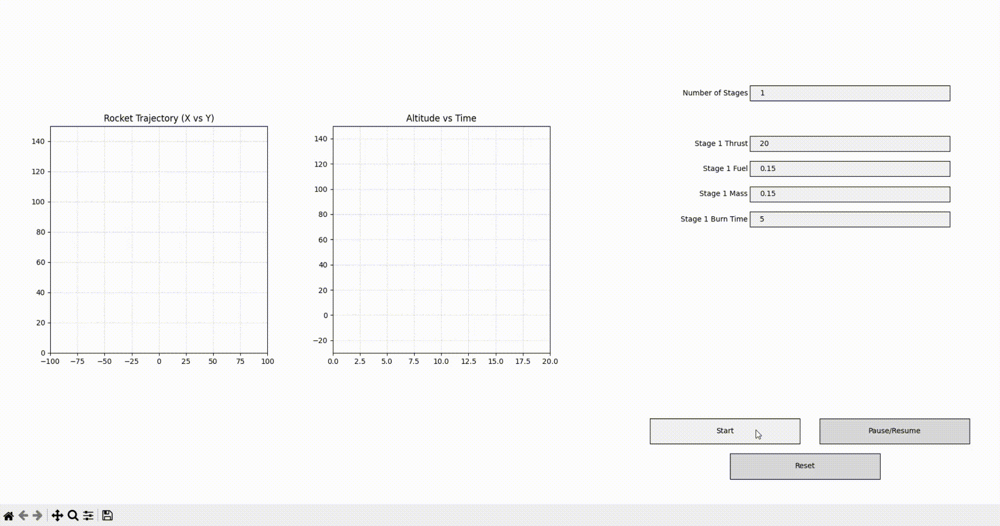

# Rocket Flight Simulator

[](https://github.com/Doge2000/flight_sim/actions/workflows/CI.yml)


A physics-based multi-stage rocket simulator that models thrust curves, drag forces, and parachute displacement. The simulator features two interfaces: a legacy matplotlib-based GUI for batch simulation and a modern web-based telemetry dashboard for real-time monitoring.

## Demos

### Legacy Interface


### Web-Based Dashboard


## Features

### Core Simulation
- Multi-stage rocket simulation with configurable thrust, fuel mass, dry mass, and burn time per stage
- Realistic physics including:
  - Thrust vectoring based on rocket angle
  - Gravity simulation (9.81 m/s²)
  - Drag modeling with different coefficients for freefall vs. parachute descent
  - Automatic pitch program initiation 2 seconds after liftoff
  - Parachute deployment at 200m altitude during descent
- High-precision simulation at 100Hz update rate

### Real-Time Telemetry
- Live telemetry streaming via WebSocket
- Real-time monitoring of:
  - Altitude, velocity, and acceleration
  - Fuel remaining and stage status
  - Flight path trajectory (X/Y/Z coordinates)
  - G-force calculations
  - Current flight stage status
- Interactive 3D visualization using Three.js showing rocket orientation, trajectory trail, and real-time position

### Dual Interface Support
- **Web Dashboard (Recommended)**: Real-time Plotly.js visualizations via WebSocket
- **Legacy GUI**: Matplotlib-based post-simulation animation with interactive controls

## System Requirements

- C++ Compiler (g++ or compatible, supports C++17)
- Python 3.7+ with:
  - For Web Dashboard:
    - FastAPI
    - Uvicorn
  - For Legacy GUI:
    - Matplotlib
    - Pandas
    - NumPy
  - For running validation tests (optional):
    - pytest

## Installation

### 1. Clone the Repository
```bash
git clone https://github.com/Doge2000/flight_sim
cd flight_sim
```

### 2. Compile the C++ Simulation Engine
```bash
g++ main.cpp -o sim.exe -std=c++17
```

### 3. Install Python Dependencies

#### For Web Dashboard (Recommended):
```bash
pip install fastapi uvicorn
```

#### For Legacy GUI:
```bash
pip install matplotlib pandas numpy
```

#### For Running Validation Tests:
```bash
pip install pytest
```

#### For All of the Above:
```bash
pip install fastapi uvicorn matplotlib pandas numpy pytest
```

## Quick Start

### Option 1: Web Dashboard (Recommended)
Experience real-time telemetry with interactive plots and 3D visualization.

1. Compile the simulation (if not already done):
   ```bash
   g++ main.cpp -o sim.exe -std=c++17
   ```

2. Start the WebSocket server:
   ```bash
   python -m uvicorn server:app --reload
   ```

3. Open your browser to: `http://localhost:8000`

4. Configure your rocket:
   - Set number of stages (1-3)
   - For each stage, configure:
     - Thrust (Newtons)
     - Fuel mass (kg)
     - Dry mass (kg)
     - Burn time (seconds)

5. Click "Start Simulation" to begin

6. Monitor real-time telemetry:
   - Altitude, velocity, and G-force readings
   - Flight status updates (Powered Ascent, Apogee, Parachute Deployed, etc.)
   - Live 2D trajectory plot
   - Interactive 3D rocket visualization

### Option 2: Legacy Matplotlib GUI
Ideal for batch simulations and detailed post-flight analysis.

1. Compile the simulation (if not already done):
   ```bash
   g++ main.cpp -o sim.exe -std=c++17
   ```

2. Run the simulation and visualization:
   ```bash
   python plot.py
   ```

3. Configure stages via the GUI interface:
   - Set number of stages
   - Adjust thrust, fuel mass, dry mass, and burn time for each stage
   - Click "Start" to run simulation and view animation

## Configuration

### Command-Line Interface
The simulator accepts command-line arguments for headless operation:

```
sim.exe <num_stages> [thrust1] [fuel1] [dry_mass1] [burn_time1] [thrust2] [fuel2] [dry_mass2] [burn_time2] ...
```

**Example for a 2-stage rocket:**
```bash
sim.exe 2 20 0.15 0.10 15 15 0.10 0.05 10
```

### Configuration File
Edit `config.txt` to set default rocket parameters:
```
2
20 0.15 0.10 15
15 0.10 0.05 10
```
First line: number of stages
Following lines: thrust fuel dry_mass burn_time for each stage

## Testing

The validation tests check the simulator's numerical output against closed-form analytical solutions, rather than just checking that the program runs.

Since the physics logic lives inline in `main()` with no separately callable functions, these are black-box tests: they run `sim.exe` as a subprocess with a special `SIM_TEST_NODRAG` environment variable that zeroes out air density (and therefore all drag), isolating the integrator from drag/wind complexity. With drag removed, two phases of flight have exact analytical answers to check against:

- **Powered ascent** — constant thrust with linearly-depleting mass has a closed-form velocity solution
- **Coast phase** — pure projectile motion under gravity alone

Run the tests with:
```bash
pip install pytest
pytest validation_test.py -v
```

`SIM_TEST_NODRAG` only affects test runs — normal simulations (web dashboard, legacy GUI, CLI) are unaffected and use full atmospheric drag as usual.

These tests run automatically on every push via GitHub Actions (see `.github/workflows/CI.yml`).

## Project Structure

```
flight_sim/
├── main.cpp             # C++ rocket simulation engine
├── server.py             # FastAPI WebSocket server for real-time telemetry
├── plot.py               # Legacy matplotlib-based simulation visualizer
├── index.html            # Web-based telemetry dashboard (with Three.js & Plotly.js)
├── config.txt             # Default rocket configuration file
├── requirements.txt      # List of prereqs to install
├── sim.csv                # Output telemetry data from simulations (used by legacy GUI)
├── sim.exe                # Compiled C++ simulation executable
├── PHYSICS.md             # Writeup of the equations of motion and physics models used
├── validation_test.py    # Validation tests vs. closed-form analytical solutions
├── .github/workflows/
│   └── CI.yml             # GitHub Actions workflow: compile + run tests on every push
├── LICENSE                 # MIT License
├── 0624.gif               # Legacy interface demo
├── webbased.gif           # Web dashboard demo
└── README.md              # This file
```

## Features in Detail

### Physics Engine
- Variable Mass System: Accurately models changing mass as fuel is consumed and stages are jettisoned
- Atmospheric Model: Exponential atmosphere model for air density variation with altitude
- Drag Coefficients: Different drag coefficients for ballistic vs. parachute configurations
- Thrust Vectoring: Thrust direction follows rocket orientation for realistic trajectory control
- Multi-Stage Separation: Automatic stage jettisoning when fuel is depleted

See [`PHYSICS.md`](PHYSICS.md) for the full breakdown of the equations, atmospheric/wind models, and known simplifications.

### Web Dashboard Features
- Real-Time Plots: Live updating altitude/velocity charts with Plotly.js
- 3D Visualization: Interactive Three.js rocket model with trajectory trail
- Responsive Design: Works on desktop and mobile devices
- Status Indicators: Color-coded flight phase indicators (ascent, apogee, parachute, landing)
- Configurable Inputs: Dynamic stage configuration panel
- Reset Functionality: Easy reset for multiple simulation runs

### Legacy GUI Features
- Interactive Sliders: Real-time parameter adjustment with TextBox widgets
- Dual Plot View: Simultaneous trajectory (X vs Y) and altitude vs time plots
- Animation Controls: Start, pause/resume, and reset controls
- Automatic Scaling: Axes automatically adjust to fit flight data
- Stage Configuration: Easy setup for multi-stage rockets via text inputs

## Troubleshooting

| Issue | Solution |
|-------|----------|
| WebSocket connection failed | Ensure the FastAPI server is running (`python -m uvicorn server:app --reload`) and accessible at `ws://localhost:8000/ws` |
| Simulation not starting | Verify that `sim.exe` has been compiled and is in the same directory as the server |
| No data appearing | Check browser console for WebSocket connection errors; ensure server is running |
| Poor performance | Reduce browser tab count or close other applications; simulation runs at 100Hz |
| Compilation errors | Ensure you have a C++17-compatible compiler installed and in your PATH |
| Missing Python modules | Install required packages using `pip install` as specified in installation instructions |
| Plotly not loading | Check internet connection for CDN delivery of Plotly.js; occurs in `index.html` |
| Three.js not loading | Check internet connection for CDN delivery of Three.js; occurs in `index.html` |
| Rocket model disappears starting simulation | Check chrome://gpu — if WebGL shows "Software only," your GPU driver is blocklisted by Chrome and can't recover from context loss under load. This is a driver limitation, not a bug. Reload the page after each run. |
| `pytest` not recognized | pytest isn't installed or isn't on PATH. Run `pip install pytest`, then try `python -m pytest validation_test.py -v` instead of the bare `pytest` command. |

## Example Configurations

### Single-Stage Sounding Rocket
```bash
sim.exe 1 15 0.20 0.05 30
```
- Thrust: 15N
- Fuel: 0.20kg
- Dry mass: 0.05kg
- Burn time: 30s

### Two-Stage Orbital Launch Vehicle
```bash
sim.exe 2 200 10.0 2.0 60  20 2.0 0.5 30
```
- Stage 1: 200N thrust, 10kg fuel, 2kg dry mass, 60s burn
- Stage 2: 20N thrust, 2kg fuel, 0.5kg dry mass, 30s burn

### Three-Stage High-Power Rocket
```bash
sim.exe 3 50 1.0 0.2 20  30 0.5 0.1 15  10 0.2 0.05 10
```
- Stage 1: 50N thrust, 1.0kg fuel, 0.2kg dry mass, 20s burn
- Stage 2: 30N thrust, 0.5kg fuel, 0.1kg dry mass, 15s burn
- Stage 3: 10N thrust, 0.2kg fuel, 0.05kg dry mass, 10s burn

### Development Setup
```bash
# Clone your fork
git clone https://github.com/yourusername/flight_sim.git
cd flight_sim

# Set up development environment
pip install -r requirements.txt  
```

## License

This project is licensed under the MIT License — see [`LICENSE`](LICENSE) for details.

## Acknowledgments

- Inspired by various open-source rocket simulation projects
- Built with Three.js for 3D graphics
- Interactive plotting with Plotly.js
- High-performance web backend with FastAPI
- Legacy plotting with Matplotlib

---

*Last updated: July 2026*